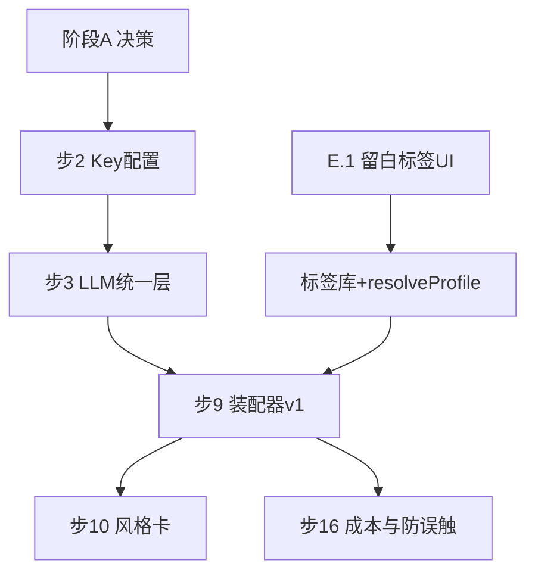

# 留白写作 — 具体实施步骤（design 真源）

> **目的**：把 `docs/总体规划-路线图与导航整合.md` 第十一章的「工单粒度」再拆一层，便于排期、分工与验收。  
> **粒度**：下文 **任务** ≈ 0.5～3 人日；带 **子步** 的可再拆 PR。  
> **真源关系**：步号仍以总体规划 **§11** 为主；本文件 **补充子步与验收细节**，冲突时以已拍板的决策记录为准。

---

## 0. 使用说明

### 0.1 如何读本文

1. 先完成 **阶段 A** 决策，再动工程。
2. **B → C** 强依赖：没有统一 LLM 调用层，装配器与流式会重复踩坑。
3. **作品标签 + 内部 profile**（总体规划 §3.5）建议在 **装配器 v1（步 9）** 同期设计接口，**UI（留白）** 可略晚于接口（先 JSON/设置里调试也可）。
4. **进阶防误触** 挂在 **成本/阈值模块** 上实现，与 **步 16** 同一套设置模型。

### 0.2 建议的仓库落点（实现时对齐，非强制）

| 领域      | 现有或预期路径                                                     |
| ------- | ----------------------------------------------------------- |
| 作品/章/圣经 | `src/db/`、`src/storage/writing-store*.ts`                   |
| UI 壳与路由 | `src/App.tsx`、`src/components/AppShell.tsx`                 |
| 留白      | `src/pages/LibraryPage.tsx`、`src/pages/HomePage.tsx`        |
| 设置      | `src/pages/SettingsPage.tsx`                                |
| AI 调用   | `src/ai/`（扩展 providers、统一 client）                           |
| 类型      | `src/db/types.ts`、云侧 `src/storage/supabase-writing-rows.ts` |

### 0.3 全局验收口径（每条大功能都应满足）

- **失败可见**：网络/Key/限流有明确文案，禁止无限转圈。  
- **隐私可述**：哪些数据出端、是否上云，与 `PrivacyPage`/`TermsPage` 一致。  
- **虚构创作**：首次开 AI 或设置内有声明入口（总体规划 §5.6）。  
- **备份心智**：云用户仍能看到导出/备份入口（总体规划 §5.4）。

---

## 1. 阶段 A — 决策收口（总体规划 §11 步 1）

**目标**：减少返工；输出一页《决策记录》可放进 `docs/`。

### A.1 文档与范围

| 子步    | 动作                                   | 产出/验收                |
| ----- | ------------------------------------ | -------------------- |
| A.1.1 | 确认 **登录默认落地页** `/` vs `/library`     | 决策记录 1 条 + 路由与书签行为写明 |
| A.1.2 | 定界 **生辉 / 推演内对话 / 问策**               | 各模块输入输出一行表；禁止交叉消费写清  |
| A.1.3 | **角色状态**：是否章节级快照、存哪张表                | ER 草图或 types 草案      |
| A.1.4 | **健康度/密度指标** 一期是否展示                  | 若不做，留白卡片二期再引         |
| A.1.5 | **第一期默认模型**（厂商+模型 id）                | 设置默认值、环境变量策略         |
| A.1.6 | **第五章 ⭐** 哪些进 P0/P1（强制确认、防误触、可解释简版等） | 分期表更新                |
| A.1.7 | **多端冲突**：仅提示 vs 其他                   | 与 Hybrid 写入策略一致      |

### A.2 合规与标签策略（与 §3.5 对齐）

| 子步    | 动作                                                     | 产出/验收           |
| ----- | ------------------------------------------------------ | --------------- |
| A.2.1 | 确认 **作品标签** 对用户的可见文案边界（只显示泛化标签名，不显示内部 profile 全文）      | 决策记录 + UI 线框一句话 |
| A.2.2 | 确认 **「大神/风格档位」** 仅内部 `profileId`，UI 用泛化名（如「厚重史诗风」）是否采纳 | 枚举命名规范          |
| A.2.3 | 用户协议中 **标签/profile 不保证与任何平台作家一致** 的表述是否纳入 6.6 工单       | 与法务/产品一句话       |

---

## 2. 阶段 B — P0：接模型 + 合规骨架（步 2～8）

### B.1 API Key 与连接配置（步 2）

| 子步    | 动作                                                         | 验收                               |
| ----- | ---------------------------------------------------------- | -------------------------------- |
| B.1.1 | 设置页多厂商：Base URL、模型名、Key 字段                                 | 值可保存；刷新后仍存在                      |
| B.1.2 | Key **掩码显示**；导出/日志不打印明文                                    | 代码检索 `console`/`localStorage` 抽检 |
| B.1.3 | 存储策略文档：`localStorage` vs 加密 vs 仅内存（写 `docs/技术说明.md` 或决策记录） | 评审通过                             |

### B.2 统一 LLM 调用层（步 3）

| 子步    | 动作                                       | 验收                    |
| ----- | ---------------------------------------- | --------------------- |
| B.2.1 | 单模块封装：`chat`/`complete`、超时、`AbortSignal` | 业务页不直接 `fetch` 厂商 API |
| B.2.2 | 统一错误类型：401/429/5xx/断网                    | 上层可 switch 出文案        |
| B.2.3 | （可选）预留 `usage` 解析字段                      | 为步 16「事后对账」留钩子        |

### B.3 虚构声明 + 首次流程（步 4）

| 子步    | 动作               | 验收         |
| ----- | ---------------- | ---------- |
| B.3.1 | 首次开启 AI 或首次请求前拦截 | 可勾选「已读」持久化 |
| B.3.2 | 文案与隐私/协议互链       | 双链可点、内容无矛盾 |

### B.4 API 失败态 UI（步 5）

| 子步    | 动作                          | 验收          |
| ----- | --------------------------- | ----------- |
| B.4.1 | 无 Key / Key 无效：主按钮禁用 + 跳转设置 | 演示路径录屏或清单勾选 |
| B.4.2 | 限流与超时：可重试提示                 | 不白屏         |

### B.5 隐私/协议更新（步 6）

| 子步    | 动作                        | 验收           |
| ----- | ------------------------- | ------------ |
| B.5.1 | 写明：请求是否含章节摘要、是否 Hybrid 同步 | 与实现一致        |
| B.5.2 | 第三方模型数据处理说明               | 6.6 最终定稿可再润色 |

### B.6 账号与云工程收尾（步 7）

| 子步    | 动作                                  | 验收                    |
| ----- | ----------------------------------- | --------------------- |
| B.6.1 | OTP、重置邮件、Redirect URLs              | 与 `docs/开发交接-*.md` 一致 |
| B.6.2 | Hybrid 读写冒烟：新建作品→上云→另一 Tab 可见（若已启用） | 测试步骤写进交接或本文附录         |

### B.7 默认落地页（步 8）

| 子步    | 动作         | 验收       |
| ----- | ---------- | -------- |
| B.7.1 | 登录后重定向与书签  | 符合 A.1.1 |
| B.7.2 | 未登录访问受保护路由 | 跳转登录     |

---

## 3. 阶段 C — P1：最小 AI 闭环（步 9～18）

### C.1 上下文装配器 v1（步 9）— 核心

**输入（概念清单）**：`workId`、`Work` 元数据、**作品标签解析后的内部 profile 文本**、当前章、邻章摘要/节选、勾选圣经条目、风格卡、（后续）RAG 块。

| 子步    | 动作                                                                | 验收                 |
| ----- | ----------------------------------------------------------------- | ------------------ |
| C.1.1 | 定义 `AssembleContext` 类型与纯函数 `assembleMessages(...)`               | 单测：固定输入 → 固定消息列表快照 |
| C.1.2 | **合并顺序** 文档化（建议：系统/虚构声明 → 风格卡+圣经 → **标签 profile** → 用户任务 → 正文/摘要） | 写在函数头注释 + 本文附录 C   |
| C.1.3 | profile **不得**默认拼接进用户可见「材料展开区」的全文                                 | UI 仅一行「已应用作品标签：…」  |
| C.1.4 | 大文本截断策略：按 token 估算或字符上限，**先丢 RAG 后丢邻章**（顺序可配置）                    | 单测或集成测一条           |

### C.2 风格卡自动注入（步 10）

| 子步    | 动作                                        | 验收           |
| ----- | ----------------------------------------- | ------------ |
| C.2.1 | 从 `WorkStyleCard` 读取并注入装配器                | 改风格卡后下一次请求生效 |
| C.2.2 | 与标签 profile 冲突时 **圣经/风格卡优先**（总体规划 §3.5.3） | 单测断言         |

### C.3 草稿区 + Diff + 流式（步 11～13）

| 子步    | 动作             | 验收                                    |
| ----- | -------------- | ------------------------------------- |
| C.3.1 | 草稿与正文状态分离      | 刷新不丢（若产品要求持久化则走 storage）              |
| C.3.2 | Diff UI + 合并入章 | 走 `repo.updateChapter` 或 store 等价 API |
| C.3.3 | SSE/流式 + 取消    | 取消后不写入正文                              |

### C.4 顶栏作品/章节上下文（步 14）

| 子步    | 动作                          | 验收       |
| ----- | --------------------------- | -------- |
| C.4.1 | `TopbarContext` 或等价源展示当前书/章 | 路由切换时更新  |
| C.4.2 | 无当前章时的空态                    | 不显示错误 id |

### C.5 「本次使用材料」简版（步 15）

| 子步    | 动作                                 | 验收     |
| ----- | ---------------------------------- | ------ |
| C.5.1 | 可折叠：章 id、圣经条数、风格卡是否启用、**标签 id 列表** | 与装配器一致 |
| C.5.2 | **不展示** 内部 profile 全文              | 产品走查   |

### C.6 成本提示 + 强制验证 + 进阶防误触（步 16 + §5.3.2）

**设置模型（建议字段，实现时可合并）**

- `costMode`: `off` | `notify` | `confirm`  
- `thresholdTokens` 或 `thresholdTier`（二选一或并存）  
- `highRiskAlwaysConfirm`: boolean  
- `antiFatFinger`: `off` | `high_risk_only` | `all_over_threshold`  
- `antiFatFingerMethods`: `{ numericCode: boolean; longPress: boolean; cooldownSec: number }`  
- 分功能阈值覆盖：`logic` / `shengHui` / `inspiration`（总体规划 §5.3.1）

| 子步    | 动作                                    | 验收                    |
| ----- | ------------------------------------- | --------------------- |
| C.6.1 | 发送前 **粗估** input 规模（无 usage 时标明非计费凭证） | UI 文案与 §5.3.1 一致      |
| C.6.2 | 超阈值 → `notify` 仅 toast；`confirm` 模态   | 可配                    |
| C.6.3 | 高危列表：**整卷仿写、批量推演、流光五连** 等（可配置 id）     | 勾选「始终确认」必弹            |
| C.6.4 | **数字确认**：模态展示 2 位数或当日码，输入一致才可继续       | 错误输入拒绝并计数（可选防爆破，本地即可） |
| C.6.5 | **长按 ≥2s**：`onPointerDown` 计时，未满释放则取消 | 与模态可叠加或设置二选一          |
| C.6.6 | **冷却**：同 `actionId` 在 N 秒内禁用按钮        | 演示连点无效                |
| C.6.7 | （可选）**会话/日累计** 超 M 二次确认               | 与 §5.3.1 软顶配合         |

### C.7 续写 + 无提示词抽卡（步 17～18）

| 子步    | 动作                           | 验收    |
| ----- | ---------------------------- | ----- |
| C.7.1 | 一键续写当前章 → 草稿                 | 复用装配器 |
| C.7.2 | 无用户提示词：前文 + 大纲（无大纲则仅前文）≥1 分支 | 进草稿列表 |

---

## 4. 阶段 D — P2：长线记忆与 RAG（步 19～28）

### D.1 摘要管线（步 19～22）

| 子步    | 动作                           | 验收                  |
| ----- | ---------------------------- | ------------------- |
| D.1.1 | Dexie + Supabase 双轨字段        | 与 `docs/技术说明.md` 同步 |
| D.1.2 | 生成任务：每章或每 N 章                | 失败可重试、状态可见          |
| D.1.3 | 摘要可编辑 + `updatedAt` + 覆盖章节范围 | 总体规划 §5.2 表         |

### D.2 人物状态快照（步 21）

| 子步    | 动作                    | 验收         |
| ----- | --------------------- | ---------- |
| D.2.1 | JSON schema 草案 + 存哪张表 | 与 A.1.3 一致 |
| D.2.2 | 装配器是否注入「最近一章快照」       | 可配置开关      |

### D.3 RAG（步 23～24）

| 子步    | 动作                      | 验收                     |
| ----- | ----------------------- | ---------------------- |
| D.3.1 | 索引对象：参考块、圣经、正文          | 与 progress cursor 关系写清 |
| D.3.2 | top-k 注入装配器             | 步 9 扩展字段               |
| D.3.3 | 藏经正文不上云存储前提下，端侧向量或关键词路径 | 与 §3.4.4 一致            |

### D.4 冲突、备份、降级、Caching（步 25～28）

按总体规划验收；**步 25** 与 Hybrid `updatedAt` 对齐。

---

## 5. 阶段 E — P3：七导航产品化（步 29～45）

### E.1 留白：书架 + 新建 + 标签 UI（步 29～31）— 与 §3.5 强相关

| 子步    | 动作                               | 验收                              |
| ----- | -------------------------------- | ------------------------------- |
| E.1.1 | 卡片布局 + 进度条 + 最后修改时间              | 大数据量性能可接受（虚拟列表可选）               |
| E.1.2 | 新建弹窗：书名、类型、简介                    | 写入 `Work`                       |
| E.1.3 | **标签多选**：平台向 / 流派向 / **同人衍生** 开关 | 存 `Work.tagIds` 或 `work_tags` 表 |
| E.1.4 | **作品设置页**或卡片菜单：**编辑标签**          | 改后立即持久化；**不自动重算**已有纲/正文         |
| E.1.5 | 从卡片进编辑器/最近章（步 31）                | 一键可达                            |

**数据模型建议（需迁移）**

- `Work` 增加 `tagIds: string[]` **或** 规范化表 `work_tags(work_id, tag_id, updated_at)`。  
- Supabase：`supabase-writing-rows.ts` + RLS 与 IndexedDB 导入导出对齐。  
- 备份 zip：包含标签；`import-normalize.ts` 缺字段时 `[]`。

### E.2 标签库与内部 profile 配置（可与 E.1 并行）

| 子步    | 动作                                                                    | 验收                 |
| ----- | --------------------------------------------------------------------- | ------------------ |
| E.2.1 | `tags.json` 或 DB 表：`id`, `category`, `userLabel`, `internalProfileId` | `userLabel` 可 i18n |
| E.2.2 | `profiles/*.md` 或 JSON：**仅后端拼接**，含流派技法段落                              | 代码审查：无真人姓名、无「抄袭」指令 |
| E.2.3 | **同人衍生** 为 true 时，可选第二维 `**stylePresetId`**（内部映射到技法包）                 | UI 显示泛化名           |
| E.2.4 | 单元测试：`resolveWritingProfile(tagIds, options) => string`               | 快照测试防回归            |

### E.3 推演 / 流光 / 藏经 / 落笔扩展（步 32～44）

按总体规划步 32～44 逐项拆 PR；**每条**依赖装配器处注明 **是否注入标签 profile**（推演与生辉一致）。

### E.4 导航减负 + 命令面板（步 45）

| 子步    | 动作           | 验收         |
| ----- | ------------ | ---------- |
| E.4.1 | ⌘K 列出路由与核心动作 | 不遮挡编辑器焦点策略 |
| E.4.2 | 次要入口收纳       | 与 4.1 总表一致 |

---

## 6. 阶段 F — P4：问策、可选项、发布（步 46～54）

| 步     | 细化提醒                   |
| ----- | ---------------------- |
| 46    | 问策复用装配器；边界写进决策记录       |
| 47～48 | 与步 16 阈值合并验收时可省重复弹窗    |
| 49～54 | 压测、无障碍、迁移、法律、checklist |

---

## 附录 A — 作品标签 + 内部 profile 专项清单

1. **产品**：标签可选、可改；改后仅影响**新请求**。
2. **数据**：Work 或关联表；云+本地+备份一致。
3. **装配器**：`resolveWritingProfile` → 拼入 system 或 assistant 前置块（实现选一种，全文不给用户看）。
4. **合规**：协议声明；禁止请求内真人姓名与洗稿指令；UI 不宣称「模仿某作家」。
5. **测试**：无标签 / 单标签 / 多标签 / 同人+preset / 与风格卡冲突。

---

## 附录 B — 进阶防误触矩阵（测试用例）

| 场景   | 阈值   | 防误触     | 预期       |
| ---- | ---- | ------- | -------- |
| 单章续写 | 低于阈值 | 关       | 直接发送     |
| 单章续写 | 高于阈值 | notify  | Toast，可发 |
| 单章续写 | 高于阈值 | confirm | 模态确认后发   |
| 整卷仿写 | 任意   | 始终确认    | 必模态      |
| 整卷仿写 | 任意   | +数字确认   | 错码不可发    |
| 连点   | 刚过冷却 | 冷却      | 第二次禁用    |

---

## 附录 C — 装配器合并顺序（参考）

建议固定顺序并在代码注释中重复：

1. 系统级：虚构创作声明、安全短约束（若有）。
2. **用户显式**：落笔圣经勾选条、风格卡、笔感样本（若有）。
3. **作品标签 → 内部 profile**（抽象技法，短于某 token 预算）。
4. 任务描述：用户提示词 / 功能模板（推演/生辉/流光）。
5. 上下文：章摘要、邻章、RAG 块（按优先级截断）。
6. 用户消息：当前正文片段或空。

**冲突规则**：同一维度上 **用户显式 > 标签 profile**（总体规划 §3.5.3）。

---

## 附录 D — 依赖关系（Mermaid）

---

## 附录 E — 与总体规划步号对照表

| 总体规划 §11 步 | 本文主要章节  |
| ---------- | ------- |
| 1          | §1 阶段 A |
| 2～8        | §2 阶段 B |
| 9～18       | §3 阶段 C |
| 19～28      | §4 阶段 D |
| 29～45      | §5 阶段 E |
| 46～54      | §6 阶段 F |

---

## 修订记录

| 日期         | 摘要                                                           |
| ---------- | ------------------------------------------------------------ |
| 2026-04-02 | 初版：按总体规划阶段 A～F 拆子步；补充 §3.5 标签/profile、§5.3.2 防误触、装配器顺序与测试矩阵。 |

*文档版本：与总体规划 v2 对齐。*