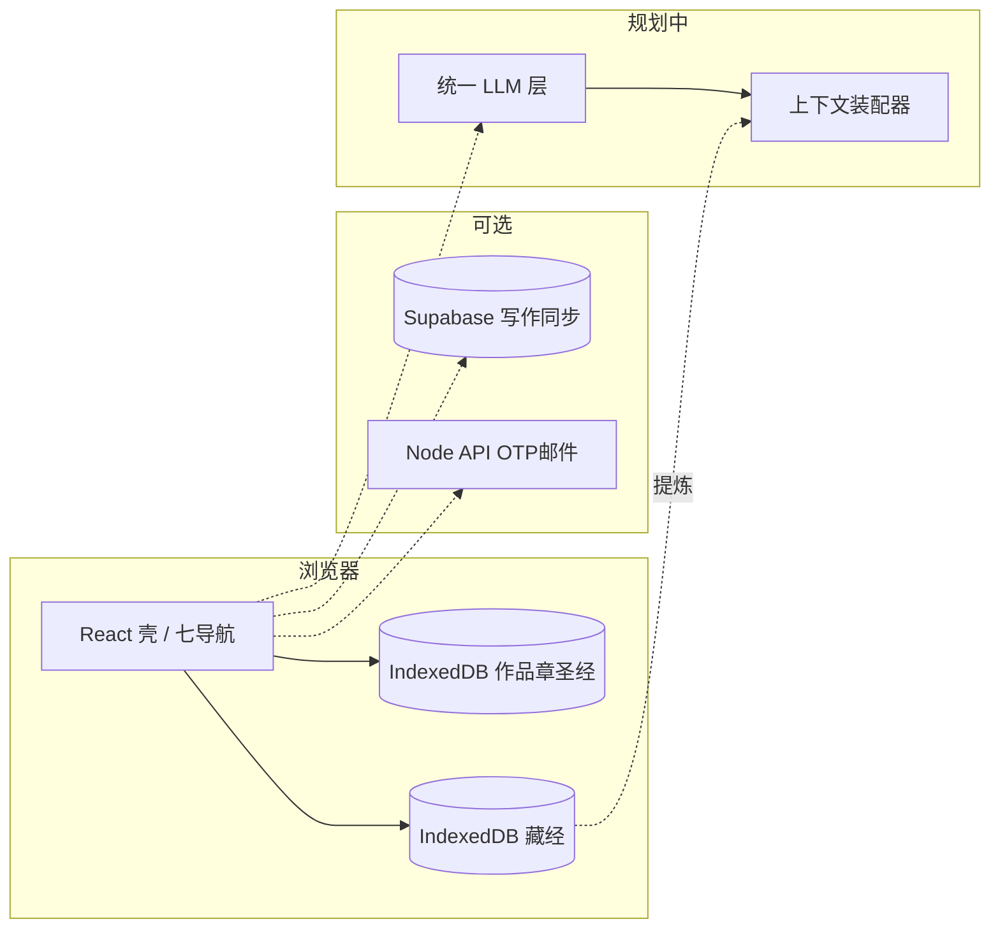

# 留白写作 — PPT 素材包（给 Claude / 人工排版）

> **用途**：按下方 `---SLIDE---` 分块复制到提示词，或导入 Gamma / Notion / Google Slides 大纲。  
> **真源文档**：`docs/总体规划-路线图与导航整合.md`、`design/implementation-steps.md`、`design/seven-modules-ui-spec.md`、`docs/生产环境部署.md`、`docs/路线图.md`。  
> **建议总页数**：约 **22～28 页**（可按听众删减「附录」类幻灯片）。

---

## 给 Claude 的一句话指令（可粘贴）

请将附件/下文 `design/ppt-source-materials.md` 中每个 `---SLIDE---` 块整理为一套中文演示文稿：每块对应 1 张幻灯片；标题不超过 12 字为宜；要点 3～6 条；避免堆砌 ID；合规与法律用中性表述；可据内容生成 1 页「产品主流程」示意图（藏经→推演→生辉→落笔）。

---

## 一页纸高管摘要（可单独做第 2 页或附录）

- **产品**：面向长篇网络文学创作与同人二创的 **本地优先写作工具 + 模块化 AI 管线**（七顶栏：留白、推演、流光、问策、落笔、生辉、藏经；设置独立）。
- **已定案管线**：**藏经**（本地参考书，不上云存正文）→ **推演**（大纲/卷纲/细纲/导图/文策/日志，关联藏经为「提炼」非洗稿）→ **定稿** → **生辉**（按纲仿写正文，消费纲+文策+**落笔圣经**）。
- **进度**：路线图 **第 0～4 组 + 藏经主体** 已落地；**第 5 组（AI 全文链路）** 未做；第 6 组部分完成；可选 **Supabase Hybrid + 邮箱 OTP** 工程增量已有文档。
- **差异化体验规划**：成本/规模可感知、超阈值强制确认与 **进阶防误触**、材料可解释、失败可降级、作品 **标签→后台写作 profile**（合规：UI 不展示具体作家营销话术）。
- **技术**：Vite + React 19 + TypeScript；IndexedDB（Dexie）；可选 Supabase；Node/Fastify 后端（注册邮件、API）；CodeMirror 编辑器。

---

---SLIDE---
**标题**：留白写作 · 定位
**要点**：

- 长篇小说 / 同人创作：作品、卷、章、圣经（设定护栏）一体化
- 顶栏 **七大功能模块 + 设置**：从「书库」到「推演纲」再到「按纲生辉」
- **数据主权**：参考库（藏经）正文 **本地**；写作与圣经可选上云（Hybrid）
- 目标：**每天用得住** — 可解释、可控制成本、可备份、合规预期清晰
**视觉建议**：产品名 + 一句副标题；浅色专业风或你方品牌色

---SLIDE---
**标题**：我们解决了什么问题
**要点**：

- 长线创作：**设定与伏笔** 易散 — 用 **落笔圣经** 与后续摘要/RAG 规划缓解
- AI 协作：**窗口与记忆** 有限 — 滚动摘要、圣经注入、按需检索（路线图 5.x）
- 同人/参考：**合规与洗稿风险** — 藏经只作 **推演阶段提炼**，生辉不直接照抄原文
- 体验：**误触烧额度、不知道模型吃了什么** — 成本提示、确认与防误触、材料简版（规划）

---SLIDE---
**标题**：核心创作管线（定案）
**要点**：

- **藏经**：用户本地书库；供推演 **关联与提炼**（结构、节奏、设定要点）
- **推演**：大纲 → 卷纲 → 细纲；文策与 **文策日志**；思维导图；对话 **改纲**
- **定稿**：用户确认纲与文策一致后，才进入正文阶段
- **生辉**：**仿写** — 严格按已定稿 **纲 + 文策**，并挂载 **落笔圣经**（本作设定为准）
**讲稿**：生辉不消费藏经原文；藏经只在推演已进入纲与文策。

---SLIDE---
**标题**：管线示意图（文字版）
**要点**（可让设计画箭头）：

```
构思 / 用户想法
    ↓
[藏经] 可选关联 → 提炼参考（非原文拼接）
    ↓
[推演] 大纲 / 卷纲 / 细纲 / 导图 / 文策 / 日志
    ↓
用户「定稿」
    ↓
[生辉] 按纲生成正文 + [落笔] 圣经约束
    ↓
[写作页] 编辑 / 合并草稿（规划）
```

---SLIDE---
**标题**：七导航 · 分工一览
**要点**（表格可拆成两页）：


| 模块  | 路由                | 一句话                  |
| --- | ----------------- | -------------------- |
| 留白  | `/library`        | 作品门户、书架、标签（规划）       |
| 推演  | `/logic`          | 纲、导图、文策、改纲对话         |
| 流光  | `/inspiration`    | 碎片灵感、扩容、进章（规划）       |
| 问策  | `/chat`           | 开放式策略/拆书（与推演边界待定）    |
| 落笔  | `/work/:id/bible` | 圣经、风格卡、设定护栏          |
| 生辉  | `/sheng-hui`      | 按纲仿写正文               |
| 藏经  | `/reference`      | 本地参考书库               |
| 设置  | `/settings`       | Key、主题、存储、阈值与防误触（规划） |


---SLIDE---
**标题**：留白 · 作品库
**要点**：

- 现状：列表与导入（txt/md/docx）等 **已有**
- 目标：**卡片 + 进度条 + 新建弹窗**；**多选作品标签**（平台/流派/同人）
- 标签 **可随时修改**；变更后 **仅影响新生成** 的 AI 请求
- 路由：`/library`；写作入口在 `**/work/:workId`**（子导航「写作」）

---SLIDE---
**标题**：推演 · 从构思到定稿
**要点**：

- 输出层次：**大纲 → 卷纲 → 细纲**；并行 **文策** 与 **时间序文策日志**
- **思维导图**：任务线、地图、NPC、卷章事件等子模式；可手改
- **藏经关联**：多选书目 → **提炼** 辅助纲与文策，**禁止洗稿式复述**
- 现状：页面 **占位为主**；依赖 **AI 调用层 + 装配器** 落地

---SLIDE---
**标题**：生辉 · 按纲仿写
**要点**：

- **输入**：已定稿纲、文策、**落笔圣经**、风格卡（数据已有，调用链规划中）
- **不做**：脱离纲的闲聊式长文生成（产品定调）
- **输出**：进 **草稿区** → diff/合并进正文（路线图 5.4）
- 依赖：**统一 LLM 客户端、流式、取消、成本确认**（第 5 组）

---SLIDE---
**标题**：落笔 · 圣经与风格
**要点**：

- **本书设定最高优先级**：人物、世界观、术语、伏笔、时间线、章模板等
- **风格卡**：人称、调性、禁用套话、文风锚点 — 每次请求注入（规划）
- **冲突规则**：圣经/风格卡 **优先于** 泛化「标签 profile」
- 状态：**结构化圣经底座已有**；模板库、词典联动等为 Backlog

---SLIDE---
**标题**：藏经 · 本地参考库
**要点**：

- **正文与分块索引仅存本机**（IndexedDB），**业务云不存书**
- 用途：推演阶段 **关联与提炼**；**不上传整书做云端 RAG 存书**
- 已有：分块、索引、阅读器、标签等（第 3 组）
- 规划：PDF、语义/向量检索、**「未上云」强提示 UI**

---SLIDE---
**标题**：流光与问策
**要点**：

- **流光**：独立碎片数据；快捷键；AI 多候选扩容；拖入章节（规划）
- **问策**：开放式对话；边界需与 **推演内「改纲对话」** 区分，避免重复
- 现状：多为 **占位**；可后期与装配器复用

---SLIDE---
**标题**：作品标签与后台 profile
**要点**：

- 对标 **起点/番茄/七猫** 心智：**多选标签**，可编辑
- 生成 **大纲/卷纲/细纲/正文** 时，装配器 **后台** 拼接 **抽象写作技法**（节奏、爽点密度、结构习惯等）
- **用户可见**：标签名称（如「玄幻」「同人衍生」）；**不展示**内部规则全文
- **合规**：内部 **profileId → 脱敏技法包**；UI **不用真实作家姓名** 做营销式档位名

---SLIDE---
**标题**：成本与防误触（体验规划）
**要点**：

- 发送前 **规模/成本粗估**（无 usage 时标明非计费凭证）
- 用户自定 **阈值**：关闭 / 仅提示 / **强制确认**；高危操作可 **始终确认**
- **进阶防误触（可选）**：输入数字确认、长按 ≥2 秒、冷却防连点
- **软顶/硬顶、会话/日累计**（可选）— 防烧穿额度

---SLIDE---
**标题**：AI 与协作 · 认知层对策
**要点**：

- 窗口限制 → **摘要 + 圣经 + 按需 RAG**
- 套路化 → **多候选抽卡 + 人择**
- 调性漂移 → **风格卡每次注入**
- 安全对齐变「和事佬」→ **虚构创作声明 + 模型路由 + 人写高潮**

---SLIDE---
**标题**：路线图进度 · 0～6 组
**要点**：


| 组   | 区间       | 状态                 |
| --- | -------- | ------------------ |
| 0   | 0.1～0.5  | ✅ 定案与选型            |
| 1   | 1.1～1.6  | ✅ 壳、路由、存储、设置       |
| 2   | 2.1～2.11 | ✅ 作品/章/备份/导入导出     |
| 3   | 3.1～3.8  | ✅ 藏经主体             |
| 4   | 4.1～4.8  | ✅ 圣经护栏             |
| 5   | 5.1～5.11 | ☐ **AI 全文链路整组未做**  |
| 6   | 6.1～6.7  | ◐ 构建✅；压测/无障碍/法律等未完 |


---SLIDE---
**标题**：工程增量 · 云与账号
**要点**：

- **Hybrid**：配置 `VITE_SUPABASE_*` 时，作品/章/圣经等 **可同步云端**；**藏经仍本地**
- **邮箱 OTP + Supabase Auth**：注册登录；Node 后端发信
- **双轨**：IndexedDB 版本迁移 + 云侧 DDL 文档化
- 详见：`docs/开发交接-2026-04-03.md`（若文件名有变以仓库为准）

---SLIDE---
**标题**：技术栈
**要点**：

- 前端：**Vite + React 19 + TypeScript + React Router 7**
- 本地存储：**Dexie / IndexedDB**；云：**Supabase JS**（可选）
- 编辑器：**CodeMirror 6**；文档：**docx/mammoth** 等导入导出
- 后端：**Fastify + pg + nodemailer**（OTP、健康检查等）
- 构建：`npm run build`；部署：静态站 + **独立 Node API** 或 **同源反代 `/api`**

---SLIDE---
**标题**：信息架构 · 壳层
**要点**：

- **AppShell**：顶栏七链接 + 账户 + 设置齿轮；**作品子栏**（写作/概要/圣经/作品库）
- **EditorShell**：全屏写作页 + 右侧 AI 栏（与 hub 页分离）
- **主题**：浅色默认 + **深色**（`data-theme="dark"`）；CSS 变量换肤
- 细节参数见：`design/seven-modules-ui-spec.md`

---SLIDE---
**标题**：分期建议 P0～P4
**要点**：

- **P0**：Key、路由、**虚构声明**、API 失败态、隐私骨架
- **P1**：最小 AI 闭环 — 装配器、风格注入、草稿与 diff、流式、成本简版、当前作品上下文
- **P2**：章摘要、人物状态、轻量 RAG、冲突提示、备份提示、失败降级
- **P3**：留白书架完整、流光、推演 v1、藏经 PDF+语义+安全锁、导航减负
- **P4**：问策定案、可选批量上限、6.x 发布 checklist

---SLIDE---
**标题**：实施阶段 · A～F（管理视角）
**要点**：

- **A** 决策收口（落地页、模块边界、默认模型、冲突策略…）
- **B** P0 接模型 + 合规
- **C** P1 最小 AI 闭环
- **D** P2 长线记忆与 RAG
- **E** P3 七导航产品化
- **F** P4 发布与问策
- 子任务级清单：`design/implementation-steps.md`；工单表：总体规划 **§11**（步 1～54）

---SLIDE---
**标题**：生产部署 · 三件事
**要点**：

- **构建时注入** `VITE_SUPABASE_URL`、`VITE_SUPABASE_ANON_KEY`（Vercel 等需 Redeploy）
- 浏览器访问的 `**/api` 必须到达 Node 后端**：否则注册 **405**；方案：**独立 API 域名**（`VITE_API_BASE`）或 **Nginx 同源反代**
- 后端：**勿**把 Service Role 进前端；配置 SMTP、数据库 Pooler、`OTP_HMAC_SECRET` 等
- 详见：`docs/生产环境部署.md`

---SLIDE---
**标题**：合规与预期（对外口径）
**要点**：

- 虚构创作说明；不鼓励现实伤害（与模型安全叙述一致）
- 二创/同人：**版权与平台规则用户自负**；产品以 **提炼与原创纲** 为主
- 标签与 profile：**辅助生成**，不保证与任何平台/作家一致
- 隐私：哪些数据出端、是否上云，与 **隐私页/用户协议** 同步更新

---SLIDE---
**标题**：文档与仓库索引
**要点**：

- `docs/总体规划-路线图与导航整合.md` — 产品真源 v2
- `docs/路线图.md` — 0.1～6.7 步号
- `design/implementation-steps.md` — 执行子步
- `design/seven-modules-ui-spec.md` — 七区路由与样式 token
- `docs/生产环境部署.md` — 线上登录注册排障
- `docs/发布检查清单.md` — 上线前勾选

---SLIDE---
**标题**：附录 · Mermaid 架构（可选一页）
**代码块**（可截图或让工具渲染）：




---SLIDE---
**标题**：附录 · 环境变量速查（前端构建）
**要点**：

- `VITE_SUPABASE_URL`、`VITE_SUPABASE_ANON_KEY` — 构建时必需（若开登录云）
- `VITE_API_BASE` — 前端请求 API 的绝对基址（无则同源 `/api`）
- `vite.config` 使用 `envDir: 'backend'`，与 CI 面板变量兼容
- 改变量后必须 **重新 build / Redeploy**

---SLIDE---
**标题**：附录 · 后端配置关键词
**要点**：

- `SUPABASE_URL`、`SUPABASE_SERVICE_ROLE_KEY`（仅服务端）
- 数据库 Pooler：`DB_HOST`、`DB_USER`、`DB_PASSWORD`、`DB_SSL=true` 等
- `OTP_HMAC_SECRET`（生产强随机）
- `MAIL_MODE`、`SMTP_`* — 注册验证码邮件
- CORS：与前端域名一致；网关需放行 **OPTIONS** 预检

---SLIDE---
**标题**：结语 · 下一步
**要点**：

- **必须先收口决策**（默认落地页、问策 vs 推演边界、P1 范围）
- 工程上 **优先统一 LLM 层 + 装配器 v1**，再铺生辉/推演重功能
- 视觉大改不影响：**换 CSS 变量与组件皮肤**；结构以路由与数据为准
- 详细验收：`design/implementation-steps.md` 各表「验收」列

---

## 可复制表格 · 状态图例（单独一页小字也可）


| 符号  | 含义        |
| --- | --------- |
| ✅   | 已完成       |
| ◐   | 部分完成      |
| ☐   | 未开始       |
| 🔜  | Backlog   |
| ⭐   | v2 体验增补建议 |


---

## 主色与字体（若 PPT 需贴近当前产品）


| 项   | 浅色                             | 深色        |
| --- | ------------------------------ | --------- |
| 主文字 | `#333333`                      | `#ffffff` |
| 次要  | `#888888`                      | 白 72% 透明  |
| 背景  | `#f3f3f3`                      | `#000000` |
| 强调色 | `#2c5aa0`                      | `#9fc0ff` |
| 字体  | PingFang SC / 微软雅黑 / system-ui | 同上        |


---

## 修订记录


| 日期         | 摘要                                   |
| ---------- | ------------------------------------ |
| 2026-04-02 | 初版：全幻灯片分块 + 摘要 + Mermaid + 部署/env 附录 |


